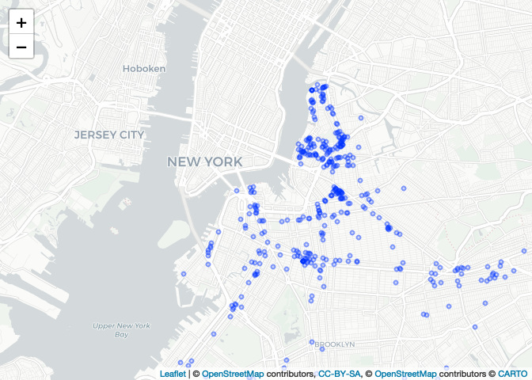

Data Analysis
================

## Data Preparation

- Subset to ug/m3 and the three given chemicals only

- Fill in missing values for `project_no` and `address` from the summary
  data

- Merge `project_id` with lat/long

<!-- -->
